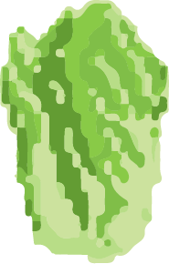

## Welcome to the Garden!
In _The Garden_ you can walk around, harvest different types of produce, enjoy the beautiful view and music, and maybe even find a secret little creature.

### Our goal!
We wanted to make a simple game that would be fun and relaxing, and that would also have pretty visuals. Through this project, we also wanted to learn the basics of creating a game using Pygame.

### Meet the player character!
This is who you pay as. You control your character using the left, right, up, and down arrows.

### The produce!
Collect produce by walking through it. Don’t worry, you won’t trample the plants. The number of vegetables you have collected will be displayed on the bottom left of the screen. Collect 20 vegetables to win a fun prize.

#### The pomegranate tree!
Yum, pomegranate!

#### The worm!

He lives here.

### Visualizations!
We created the visualizations ourselves, using pixilart.com. We were inspired by 2D games, such as Stardew Valley and Undertale, in our design. 

## How to play
The game opens with a start screen. Click on the start button to begin. Then, use your up, down, left, and right arrows to control the character's movement. Your goal is to eat as many vegetables from the garden as possible by walking through them.

### Game Demo!
[Link to YouTube video](https://youtu.be/-90kkBX34ZA)

### Presentation
[Our presentation](https://olincollege-my.sharepoint.com/:v:/g/personal/nsacks_olin_edu/Ee0tj4s1mopHqzpqz1B0E5oBO10Ou4pBAiFQ6uNBYuTVIw?e=eSBm1d)

## Download here!
To play this game, you can download it from our [Github repository](https://github.com/olincollege/the-garden). You will need to have python and pygame installed. Run the following command in your terminal to start the game:
$ python main.py
For more detailed instructions and documentation, view the README file in the repository.

### Testing
We included two unit tests in our repository, to test the point counter and the collisions. These were the only two unit tests that we could implement, as our game is mostly centered on just drawing the model. However, we did extensive manual testing to make sure everything worked correctly.

### Takeaways
- Don’t focus on a single feature too much.
  - Suki tried to implement scrolling but couldn’t figure it out. This led to a delay on things by multiple days.
- It’s okay to not reach your original project design.
  - We were both new at Pygame, so getting familiar took some valuable project time.
- Pygame is incredibly tedious.

In the next steps of our project, we want to add some roleplaying components, and expand the setting to have additional scenes.

### Meet the creators!
#### Natsuki Sacks 
Olin College of Engineering 25’
Loves sustainability, plants, and shrimp (a little too much).

#### Olga Pidruchna
Olin College of Engineering 25’
A big fan of art, boba, and the color green.

### Credits
We got our music from mixkit.co and www.zapsplat.com.
